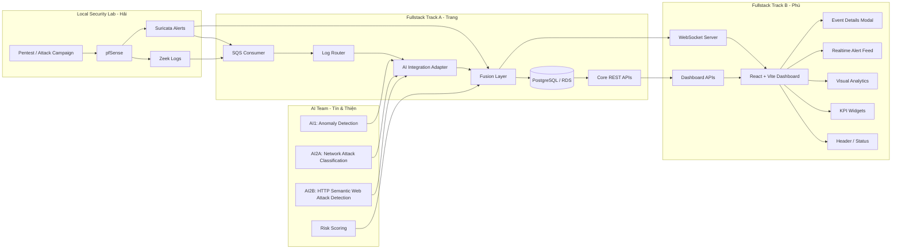

# AI-Powered Multi-Model Hybrid Cloud Security Monitoring Platform

Nền tảng giám sát bảo mật hybrid cloud tích hợp AI đa mô hình, được thiết kế để thu thập log từ Local Lab, xử lý qua backend realtime và hiển thị cảnh báo trên SOC Dashboard.

README này phản ánh hướng phân công đã được nhóm cập nhật: do việc chia riêng Backend và Frontend gây nhiều phụ thuộc và dễ rối khi tích hợp, **2 thành viên CNPM sẽ làm fullstack theo 2 track chính**. Các thành viên AI và BMTT vẫn giữ vai trò chuyên môn, cung cấp model, dataset, lab và security evidence để tích hợp vào hệ thống.

## Trạng Thái Hiện Tại

Repo hiện đang ở giai đoạn **thiết kế/đề cương dự án**. Source code backend, frontend, AI engine và simulator sẽ được bổ sung trong các giai đoạn tiếp theo.

Dashboard hiện tại là **AI-generated concept UI** dựa trên mô tả tính năng của hệ thống, chưa phải giao diện đã tích hợp source code thật.

## Thành Viên Và Vai Trò Cập Nhật

| Thành viên | Chuyên ngành | Vai trò cập nhật |
|---|---|---|
| Trang | CNPM | Fullstack Track A - Data & AI Integration: FastAPI, PostgreSQL/RDS, SQS consumer, log routing, tích hợp AI output/API, Fusion Layer, API cho dashboard |
| Phú | CNPM | Fullstack Track B - Real-time & UX Dashboard: React + Vite Dashboard, WebSocket realtime, MITRE mapping, event detail modal, Docker, CloudWatch, CI/CD, tài liệu kỹ thuật |
| Tín | AI (ML 1) | AI Anomaly Detection: xây dựng mô hình phát hiện bất thường bằng Isolation Forest |
| Thiện | AI (ML 2) | AI2A & AI2B: xây dựng 2 mô hình riêng gồm Network Attack Classification và HTTP Semantic Web Attack Detection; hỗ trợ confidence/risk scoring cho Fusion Layer |
| Hải | BMTT | Security Engineer: dựng Local Lab bằng pfSense/Suricata, thực hiện pentest, thu evidence, ánh xạ MITRE ATT&CK |

Lưu ý: **fullstack ở đây áp dụng cho 2 thành viên CNPM**, không có nghĩa 5 thành viên đều chuyển sang làm fullstack. Tín, Thiện và Hải vẫn tập trung vào chuyên môn AI/BMTT, nhưng cần cung cấp output rõ ràng để hai track phần mềm tích hợp.

## Vì Sao Chuyển Sang Fullstack Theo Track

Nếu chia cứng một người Backend và một người Frontend, nhóm dễ gặp các vấn đề:

- Frontend phải chờ Backend xong API mới làm tiếp.
- Backend tạo API nhưng Frontend cần format khác, phải sửa qua lại nhiều lần.
- WebSocket, dashboard state và event schema bị lệch khi hai bên hiểu khác nhau.
- Khi demo lỗi, khó xác định lỗi nằm ở API, WebSocket, mapping hay UI.

Vì vậy, nhóm chuyển sang cách làm:

```text
Trang -> Track A: Data & AI Integration end-to-end
Phú   -> Track B: Real-time & UX Dashboard end-to-end
```

Mỗi track vẫn có cả backend và frontend, nhưng có trọng tâm khác nhau. Trang nghiêng về pipeline dữ liệu, AI, Fusion và API. Phú nghiêng về dashboard, realtime UX, WebSocket, packaging và demo.

## Kiến Trúc Tổng Quan



## Track A - Data & AI Integration

Người phụ trách: **Trang**

Track A chịu trách nhiệm biến log và output của đội AI thành final alert có thể lưu database, query qua API và đẩy sang dashboard.

### Nhiệm Vụ Chính

1. **Database Setup**
   - Thiết lập PostgreSQL hoặc Amazon RDS.
   - Tạo bảng `alerts` để lưu kết quả cuối từ Fusion Layer.
   - Lưu các trường cần cho dashboard: severity, attack type, source/destination, risk score, confidence, MITRE, raw evidence.

2. **SQS Consumer**
   - Viết background task trong FastAPI để poll message từ AWS SQS.
   - Dùng batch polling thay vì lấy từng message đơn lẻ.
   - Xử lý retry và chỉ delete message sau khi xử lý/lưu thành công.

3. **Log Routing**
   - Nếu message là Zeek `conn.log`, chuyển qua AI1 anomaly detection và AI2A network attack classification.
   - Nếu message là Zeek `http.log`, chuyển qua AI2B HTTP semantic web attack detection.
   - Nếu message là Suricata alert, đưa vào Fusion Layer như rule-based evidence.

4. **AI Integration**
   - Tích hợp output/API từ Tín cho anomaly detection.
   - Tích hợp output/API từ Thiện cho AI2A network attack classification.
   - Tích hợp output/API từ Thiện cho AI2B HTTP semantic web attack detection.
   - Chuẩn hóa output AI về cùng schema để Fusion Layer xử lý.

5. **Batch Prediction / ONNX Runtime**
   - Nếu dùng model local, load model `.onnx` bằng `onnxruntime`.
   - Gom nhiều log thành batch, trích xuất feature thành ma trận và inference một lần.
   - Tránh single prediction từng dòng log.

6. **Fusion Layer**
   - Tổng hợp kết quả AI và Suricata evidence.
   - Tạo final attack type.
   - Tính severity, risk score và confidence score.
   - Gắn MITRE ATT&CK technique nếu có mapping.

7. **Core REST API**
   - API lấy danh sách alert.
   - API lấy chi tiết alert.
   - API lấy dashboard summary từ database.
   - API hỗ trợ filter theo severity, attack type, IP và thời gian.

### Output Của Track A

- FastAPI backend chạy được.
- SQS consumer đọc được message theo batch.
- Database schema cho `alerts`.
- Fusion Layer tạo final alert.
- API trả dữ liệu đúng contract cho Track B.
- Mock/replay mode để demo khi chưa có SQS thật.

## Track B - Real-time & UX Dashboard

Người phụ trách: **Phú**

Track B chịu trách nhiệm biến dữ liệu từ Track A thành dashboard realtime có thể demo rõ ràng, đồng thời xử lý các phần WebSocket, packaging, monitoring và tài liệu kỹ thuật.

### Nhiệm Vụ Chính

1. **React + Vite Dashboard**
   - Dựng project React + Vite.
   - Dùng Tailwind CSS để xây giao diện dark theme.
   - Tổ chức component theo khu vực dashboard.

2. **WebSocket Server / Client**
   - Cấu hình FastAPI WebSocket hoặc phối hợp với Track A để nhận alert realtime.
   - Frontend tự động insert alert mới lên đầu bảng.
   - Hiển thị trạng thái connected/disconnected trên Header.

3. **MITRE Mapping**
   - Xây dựng bộ mapping attack type sang MITRE ATT&CK.
   - Ví dụ: SQL Injection -> `T1190`.
   - Hiển thị MITRE badge trong alert table và event detail modal.

4. **Dashboard Layout**
   - Header.
   - KPI widgets.
   - Visual analytics.
   - Real-time alert feed.
   - Event details modal.
   - Action buttons.
   - Model/data source status nếu còn thời gian.

5. **Incident Actions**
   - `Block Source IP`: mô phỏng gửi lệnh xuống pfSense và hiện toast.
   - `Export Report`: export CSV/PDF.
   - `Create Case`: có thể bổ sung nếu kịp.

6. **Docker / CloudWatch / CI-CD / Docs**
   - Đóng gói frontend bằng Docker.
   - Cấu hình log/metrics cơ bản lên CloudWatch.
   - Thiết lập CI/CD cơ bản nếu còn thời gian.
   - Viết tài liệu chạy frontend và tài liệu demo.

### Output Của Track B

- React + Vite dashboard chạy được.
- UI bám sát concept dashboard.
- WebSocket realtime hoạt động với mock hoặc alert thật.
- Event detail modal hiển thị evidence và decision flow.
- Dockerfile/frontend packaging.
- Tài liệu hướng dẫn chạy dashboard/demo.

## AI Team

Hai thành viên AI tập trung vào model, feature, inference output và metrics. Track A cần nhận được output rõ ràng để tích hợp.

### Tín - AI Anomaly Detection

Nhiệm vụ:

- Xây dựng mô hình phát hiện bất thường bằng Isolation Forest.
- Input chính: Zeek `conn.log`.
- Output: normal/anomaly, anomaly score.
- Hỗ trợ định nghĩa feature schema cho network flow.
- Cung cấp model/API inference hoặc file ONNX nếu chạy local.

### Thiện - AI2A & AI2B

Nhiệm vụ:

- Xây dựng **AI2A - Network Attack Classification**.
  - Input chính: flow-level features từ Zeek `conn.log`.
  - Model dự kiến: XGBoost hoặc Random Forest.
  - Classes trọng tâm: Normal, Port Scan, DoS/DDoS, Brute Force, Botnet nếu đủ dữ liệu.
  - Output: `attack_type`, `confidence_score`.
- Xây dựng **AI2B - HTTP Semantic Web Attack Detection**.
  - Input chính: HTTP semantic features từ Zeek `http.log`.
  - Model dự kiến: XGBoost hoặc Random Forest; Logistic Regression có thể dùng làm baseline.
  - Classes trọng tâm: Normal, XSS, SQL Injection.
  - Output: `web_attack_type`, `confidence_score`.
- Hỗ trợ risk scoring ở mức model output để Fusion Layer tổng hợp thành final risk score.
- Hỗ trợ chuẩn hóa output của AI2A và AI2B cho Track A tích hợp.

## Security Engineer - Hải

Security Engineer chịu trách nhiệm tạo môi trường và bằng chứng bảo mật để hệ thống có dữ liệu thật cho demo.

Nhiệm vụ:

- Dựng Local Lab với pfSense, Zeek và Suricata.
- Cấu hình mạng attacker/victim/user VM.
- Thực hiện pentest và attack campaign.
- Thu Zeek logs và Suricata alerts.
- Ghi attack diary theo timestamp để hỗ trợ gán nhãn.
- Ánh xạ MITRE ATT&CK cho các loại tấn công chính.

Các attack cần ưu tiên:

- Port Scan.
- DoS/DDoS.
- Brute Force.
- XSS.
- SQL Injection.
- Command Injection hoặc Path Traversal nếu đủ thời gian.

## Dashboard Requirements

Dashboard concept gồm 6 khu vực chính.

### 1. Header

Chức năng: quản lý trạng thái hệ thống và phiên đăng nhập.

Dữ liệu hiển thị:

- Tên hệ thống: `Hybrid SOC - Zeek & AI Fusion`.
- Trạng thái WebSocket: xanh khi realtime connected, đỏ khi mất kết nối.
- Trạng thái Engine: AWS SQS, AI1, AI2A, AI2B, Fusion Layer.
- Thông tin admin: tên, avatar, đăng xuất.

### 2. KPI Widgets

Chức năng: cung cấp cái nhìn toàn cảnh trong 24h.

Dữ liệu hiển thị:

- Total Network Flows: tổng số dòng log kéo về từ Zeek `conn.log`.
- Total Fusion Alerts: tổng số alert đã được Fusion Layer chốt và lưu database.
- Top Threat: loại tấn công xuất hiện nhiều nhất trong 24h.

### 3. Visual Analytics

Chức năng: trực quan hóa xu hướng traffic và tấn công.

Thành phần:

- Real-time line chart cho network activity.
- Red spikes khi AI anomaly phát hiện bất thường.
- Doughnut chart cho phân bổ attack type: DoS, XSS, SQLi, Port Scan, Brute Force.

### 4. Realtime Alert Feed

Chức năng: hiển thị alert realtime từ WebSocket.

Cột dữ liệu:

- Date & Time.
- Severity.
- Source IP -> Destination IP.
- Destination Port.
- Attack Type.
- Risk Score / Confidence.
- Detected By.
- MITRE ATT&CK.

### 5. Event Details Modal

Chức năng: xem sâu bằng chứng và luồng phân tích.

Dữ liệu:

- Thông tin tóm tắt: thời gian, IP, cổng, loại tấn công.
- Zeek evidence:
  - Web alert: `uri`, `user_agent`, `method`.
  - Network alert: `duration`, `orig_bytes`, `conn_state`.
- Suricata evidence nếu có.
- MITRE ATT&CK badge có link.
- Decision Flow.
- AI analysis.

Ví dụ decision flow:

```text
Zeek http.log -> AI Web Classifier 98% + Suricata No Alert -> Fusion Layer: XSS
Zeek conn.log -> AI Anomaly Yes + AI Classifier DoS 92% -> Fusion Layer: DoS
```

### 6. Action Buttons

Chức năng: mô phỏng incident response.

Nút chính:

- Block Source IP.
- Export Report.
- Create Case, nếu đủ thời gian.

## Performance Strategy

Hệ thống cần tránh bị nghẽn khi Kali Linux hoặc attack campaign tạo nhiều log.

### 1. AWS SQS Batch Polling

Vấn đề: nếu backend lấy từng message riêng lẻ từ SQS, hệ thống sẽ chậm và tốn nhiều API call.

Giải pháp:

- Dùng `boto3`.
- Poll theo batch bằng `MaxNumberOfMessages=10`.
- Có thể tăng batch size khi hệ thống ổn định.
- Xử lý delete message chỉ sau khi lưu kết quả thành công.

### 2. Batch Prediction

Vấn đề: nếu AI inference chạy từng dòng log, CPU dễ bị nghẽn.

Giải pháp:

- Gom nhiều log thành batch.
- Trích xuất feature thành ma trận.
- Gọi model một lần cho cả batch.
- Trả kết quả theo danh sách để Fusion Layer xử lý tiếp.

### 3. ONNX Runtime Thay Vì Pickle

Lý do:

- File `.pkl` phụ thuộc phiên bản thư viện như scikit-learn hoặc XGBoost.
- File `.onnx` dễ deploy hơn, chỉ cần `onnxruntime`.
- ONNX Runtime nhẹ hơn và phù hợp cho inference service.

## Backend - Frontend Contract

Track A và Track B cần thống nhất contract sớm để Phú có thể làm dashboard bằng mock data trong lúc Trang nối SQS/AI thật.

### Alert Schema

```json
{
  "id": "INC-2025-05-19-1024-001",
  "timestamp": "2025-05-19T10:24:19Z",
  "severity": "CRITICAL",
  "attack_type": "SQL Injection",
  "source_ip": "203.0.113.45",
  "destination_ip": "10.0.12.15",
  "source_port": 54321,
  "destination_port": 443,
  "protocol": "TCP",
  "direction": "External -> Internal",
  "confidence_score": 0.96,
  "risk_score": 95,
  "detected_by": ["AI2B", "Suricata"],
  "mitre": {
    "technique_id": "T1190",
    "technique_name": "Exploit Public-Facing Application"
  },
  "raw_payload": "POST /login.php HTTP/1.1 ...",
  "zeek_evidence": {},
  "suricata_evidence": {},
  "ai_analysis": {},
  "decision_flow": []
}
```

### API Dự Kiến

| Method | Endpoint | Phụ trách chính | Mục đích |
|---|---|---|---|
| `GET` | `/api/dashboard/summary` | Track A + Track B | Lấy KPI tổng quan |
| `GET` | `/api/alerts` | Track A | Lấy danh sách alert có filter/pagination |
| `GET` | `/api/alerts/{id}` | Track A | Lấy chi tiết một alert |
| `GET` | `/api/network/activity` | Track B | Lấy dữ liệu biểu đồ network activity |
| `GET` | `/api/attacks/distribution` | Track B | Lấy tỷ lệ attack type |
| `GET` | `/api/models/status` | Track A + AI Team | Lấy trạng thái AI models |
| `GET` | `/api/data-sources/health` | Track A + Hải | Lấy trạng thái Zeek, Suricata, SQS |
| `POST` | `/api/actions/block-ip` | Track B + Hải | Mô phỏng block source IP |
| `GET` | `/api/reports/export` | Track B | Export report CSV/PDF |

### WebSocket Event

```json
{
  "event": "alert.created",
  "data": {
    "id": "INC-2025-05-19-1024-001",
    "timestamp": "2025-05-19T10:24:19Z",
    "severity": "CRITICAL",
    "attack_type": "SQL Injection",
    "source_ip": "203.0.113.45",
    "destination_ip": "10.0.12.15",
    "confidence_score": 0.96,
    "risk_score": 95
  }
}
```

## Cấu Trúc Repo Dự Kiến

```text
.
├── backend/
│   ├── app/
│   │   ├── main.py
│   │   ├── api/
│   │   ├── consumers/
│   │   ├── normalizers/
│   │   ├── ai_integration/
│   │   ├── fusion/
│   │   ├── db/
│   │   └── websocket/
│   └── requirements.txt
├── frontend/
│   ├── src/
│   │   ├── components/
│   │   ├── pages/
│   │   ├── services/
│   │   ├── types/
│   │   └── styles/
│   └── package.json
├── ai-engine/
├── simulator/
├── datasets/
└── README.md
```

## Tech Stack

| Mảng | Công nghệ |
|---|---|
| Backend | FastAPI, WebSocket, boto3, PostgreSQL/RDS |
| Frontend | React, Vite, Tailwind CSS, chart components |
| AI Inference | Python, ONNX Runtime, Isolation Forest, XGBoost |
| Security Telemetry | Zeek, Suricata, pfSense |
| Cloud | AWS VPC, EC2, SQS, S3, CloudWatch, IAM, RDS |
| DevOps | Docker, CI/CD |
| Attack/Data Generation | Nmap, Hydra, hping3, SQLMap, Burp Suite, Selenium/Playwright/Locust |

## Roadmap Triển Khai

| Giai đoạn | Track A - Trang | Track B - Phú | AI/BMTT |
|---|---|---|---|
| Phase 1 | Setup FastAPI, mock API, DB schema | Setup React + Vite, dashboard layout | Chuẩn hóa feature/output format cho AI1, AI2A, AI2B |
| Phase 2 | REST API cho KPI, alerts, detail | Render KPI, alert table, modal bằng mock API | Dựng lab, chuẩn bị sample logs |
| Phase 3 | SQS consumer mock/replay, log normalizer | WebSocket client/server, realtime alert feed | Train baseline AI, mapping MITRE |
| Phase 4 | Tích hợp AI outputs/API, Fusion Layer | Hoàn thiện charts, filters, states | Thu attack logs, export model/API cho AI1, AI2A, AI2B |
| Phase 5 | RDS, batch polling, batch prediction | Hiển thị confidence, risk score, decision flow | Kiểm thử model với log lab |
| Phase 6 | CloudWatch metrics, report APIs | Docker packaging, polish dashboard | Demo pentest end-to-end |

## Definition Of Done

Một tính năng được xem là hoàn thành khi:

- Có API/WebSocket hoặc mock endpoint rõ ràng.
- Frontend hiển thị được dữ liệu tương ứng.
- Có loading, empty và error state cơ bản.
- Dữ liệu dùng đúng schema đã thống nhất.
- Nếu là alert, phải có severity, attack type, confidence/risk score và timestamp.
- Nếu là detail modal, phải có evidence và decision flow.
- Có thể demo được trong dashboard.

## Kết Luận

Hướng cập nhật của nhóm là hợp lý: **2 thành viên CNPM làm fullstack theo 2 track**, thay vì chia cứng một người Backend và một người Frontend. Trang tập trung vào Data & AI Integration, Phú tập trung vào Real-time & UX Dashboard, nhưng cả hai đều cần hiểu và xử lý được cả API, WebSocket, dữ liệu và UI trong phạm vi track của mình.

Luồng sản phẩm cốt lõi:

```text
Zeek/Suricata Logs -> SQS -> FastAPI Backend -> AI/Fusion -> PostgreSQL/RDS -> WebSocket/API -> React Dashboard
```

Ưu tiên trước mắt là làm dashboard chạy được end-to-end bằng mock/replay data, sau đó thay dần bằng SQS thật, AI output thật, Fusion Layer hoàn chỉnh và log thật từ Local Lab.
