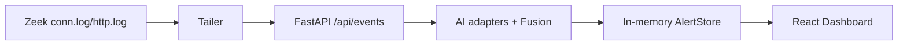
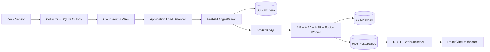

# Báo cáo thay đổi Source Code

> Cập nhật: 15/07/2026
> Phạm vi: chuyển ứng dụng từ bản local/mock-first sang application contract phù hợp kiến trúc Hybrid Cloud SOC.

## 1. Mục đích tài liệu

Tài liệu này giải thích:

- source cũ có những vấn đề gì;
- source mới đã thay đổi những thành phần nào;
- mỗi thay đổi khắc phục vấn đề cũ ra sao;
- hành vi nào bị thay đổi khi chuyển từ local sang AWS;
- phần nào vẫn chưa hoàn thành và không được xem là đã triển khai production.

Trong tài liệu này, **source cũ** là trạng thái ứng dụng trước đợt refactor Hybrid Cloud SOC hiện tại. Đây không phải bản tổng hợp toàn bộ lịch sử Git của dự án.

## 2. Tóm tắt trước và sau

| Khu vực | Source cũ | Source mới |
|---|---|---|
| Zeek Collector | Đọc log rồi POST trực tiếp; hết số lần retry có thể bỏ qua event. | Ghi event vào SQLite outbox trước khi POST, retry qua restart và chỉ xóa sau khi backend xác nhận. |
| Ingestion API | Chủ yếu dùng `/api/events*`, xử lý đồng bộ trong process backend. | Có canonical `POST /ingest/zeek`, xác thực HMAC, lưu raw S3 và enqueue SQS. |
| Data Contract | Payload khá permissive; evidence sai kiểu có thể gây lỗi sâu trong pipeline. | Validate schema, IP, timestamp, evidence, JSON depth và số hữu hạn trước SQS. |
| AI pipeline | Model mock/replay và model thật dễ bị trộn lẫn về trạng thái hiển thị. | Runtime công bố rõ `real`, `replay`, `unavailable`; AWS mặc định bắt buộc cả ba model thật healthy. |
| DoS/DDoS | Phân tích từng flow riêng nên burst nhiều kết nối vẫn có thể bị xem là normal. | Bổ sung rolling network-rate features cho AI1/AI2A và tín hiệu DoS/DDoS. |
| Persistence | Alert chủ yếu ở memory, mất khi backend restart. | Final Alert và analyst action được lưu vào RDS PostgreSQL; raw/evidence lưu S3. |
| Realtime | WebSocket chỉ biết alert trong cùng process. | Mỗi API node poll incremental từ RDS rồi broadcast tới socket cục bộ. |
| Frontend | Nhiều màn hình và trạng thái dùng mock/fabricated data. | Live/AWS render dữ liệu REST/WebSocket thật hoặc hiển thị rõ empty/unavailable. |
| Cloud config | Localhost/hard-coded config và thin-slice cloud chưa khớp sơ đồ mới. | Cấu hình same-origin CloudFront, env AWS, systemd, model sync và resource naming contract. |
| Security | Secret có thể lấy trực tiếp từ env; JSON/S3 idempotency chưa đủ chặt. | AWS lấy HMAC qua Secrets Manager, strict JSON, immutable S3 write và fail-closed. |

## 3. Luồng xử lý cũ

Luồng cũ chủ yếu phù hợp việc demo local:



Các vấn đề chính:

1. backend dừng hoặc restart thì alert trong memory biến mất;
2. tailer POST lỗi nhiều lần có thể chuyển sang event khác mà không có hàng đợi bền vững;
3. API, AI inference và lưu alert nằm trên cùng đường request đồng bộ;
4. WebSocket chỉ phản ánh state của một process;
5. frontend có thể hiển thị dữ liệu mẫu như thể đó là dữ liệu runtime thật;
6. cấu hình này không phù hợp khi backend chạy nhiều EC2 trong Auto Scaling Group.

## 4. Luồng xử lý mới



Luồng mới tách ingestion khỏi AI inference bằng SQS. Backend chỉ trả HTTP `202` khi raw event đã được archive và message đã được SQS chấp nhận.

## 5. Thay đổi chi tiết

### 5.1. Zeek Collector/Tailer

File chính: [`backend/scripts/tail_zeek_correlated_to_backend.py`](backend/scripts/tail_zeek_correlated_to_backend.py)

#### Vấn đề của source cũ

- Event được POST trực tiếp tới backend.
- Retry có giới hạn; sau khi thất bại không có durable outbox để phục hồi.
- Backend outage có thể làm vòng đọc log bị chặn lặp lại trên từng event.
- Một `event_id` có thể đại diện cho cả bản `http_only` và bản `combined` có payload khác nhau.
- JSON có `NaN` hoặc `Infinity` có thể đi sâu vào pipeline.
- SSH reconnect dùng `tail -n 0 -F`, vì vậy có khoảng trống dữ liệu khi mất kết nối.

#### Source mới khắc phục

- Thêm SQLite outbox với WAL và `synchronous=FULL`.
- Event được serialize và commit vào outbox **trước** network I/O.
- Trạng thái retry/backoff được lưu trong SQLite và tồn tại qua process restart.
- Thêm global outage circuit để event mới không tự tạo một chuỗi timeout riêng khi backend đang down.
- Canonical `/ingest/*` chỉ được ACK khi backend trả đúng HTTP `202`; local legacy endpoint chấp nhận `2xx`.
- Thêm identity ledger để phát hiện việc tái sử dụng cùng `event_id` với payload khác.
- Mỗi revision có immutable `event_id`; `correlation_id` và `transaction_id` vẫn ổn định để liên kết các revision.
- Reject JSON chứa `NaN`/`Infinity` và chuẩn hóa các numeric feature không hữu hạn.

#### Giới hạn còn lại

SQLite chỉ bảo vệ event sau khi row Zeek đã tới correlator. Chế độ SSH vẫn có thể bỏ lỡ row trong thời gian mất kết nối hoặc log rotation. Production nên chạy collector có checkpoint inode/offset trực tiếp trên Zeek host.

Chi tiết: [`docs/zeek_collector_delivery_durability.md`](docs/zeek_collector_delivery_durability.md).

### 5.2. Canonical ingestion và Data Contract

File chính:

- [`backend/app/main.py`](backend/app/main.py)
- [`backend/app/contracts.py`](backend/app/contracts.py)
- [`backend/app/services/ingest_auth.py`](backend/app/services/ingest_auth.py)
- [`backend/app/services/telemetry_pipeline.py`](backend/app/services/telemetry_pipeline.py)

#### Vấn đề của source cũ

- `/api/events*` vừa nhận telemetry vừa chạy inference đồng bộ.
- Payload thiếu/sai kiểu có thể gây lỗi như gọi `.get()` trên `None` hoặc string.
- Không có canonical public ingestion contract dành cho CloudFront/WAF/ALB.
- Không có giới hạn body và kiểm tra JSON depth rõ ràng.
- Collector authentication chưa tách khỏi operator authentication.

#### Source mới khắc phục

- Thêm `POST /ingest/zeek` trả HTTP `202 Accepted`.
- Đọc request theo stream và áp dụng `INGEST_MAX_BODY_BYTES`.
- Validate bắt buộc:
  - `schema_version=1.0`;
  - `event_id`, `sensor_id`, timestamp có timezone;
  - IPv4/IPv6 nguồn và đích hợp lệ;
  - `evidence.http`, `evidence.flow`, `evidence.suricata` phải là object hoặc `null`;
  - evidence phù hợp với `event_type`;
  - JSON không vượt độ sâu cho phép;
  - không chứa `NaN`, `Infinity` hoặc `-Infinity`.
- Ký HMAC SHA-256 trên `timestamp + raw body` và kiểm tra replay window.
- Trong AWS/cloud-like target, HMAC luôn bắt buộc và backend chỉ lấy secret qua `INGEST_HMAC_SECRET_ID` từ Secrets Manager.
- `/api/events*` và replay route bị disable mặc định trong AWS.

### 5.3. S3 raw log và evidence

File chính: [`backend/app/services/s3_data_store.py`](backend/app/services/s3_data_store.py)

#### Vấn đề của source cũ

- Raw Zeek event và Final Alert evidence chưa có storage contract thống nhất.
- Retry có nguy cơ ghi đè object nếu cùng key nhưng khác nội dung.
- Local và AWS chưa có fail-closed behavior rõ ràng khi thiếu data bucket.

#### Source mới khắc phục

- Raw event được lưu dưới prefix `raw/zeek/<yyyy>/<mm>/<dd>/...`.
- Alert evidence được lưu dưới prefix `evidence/alerts/<yyyy>/<mm>/<dd>/...`.
- JSON được serialize deterministic và gắn SHA-256 metadata.
- Dùng `IfNoneMatch="*"` để không overwrite object đã tồn tại.
- Xử lý cả HTTP `409 ConditionalRequestConflict` và `412 PreconditionFailed`.
- Retry cùng nội dung được xem là idempotent; cùng key nhưng khác nội dung sẽ fail.
- Local không có bucket là no-op có chủ đích; AWS thiếu `S3_DATA_BUCKET` sẽ fail-closed.
- Hỗ trợ SSE-KMS qua `S3_KMS_KEY_ID`.

### 5.4. Amazon SQS và worker

File chính:

- [`backend/app/services/sqs_producer.py`](backend/app/services/sqs_producer.py)
- [`backend/app/workers/sqs_rds_worker.py`](backend/app/workers/sqs_rds_worker.py)

#### Vấn đề của source cũ

- SQS thin-slice chưa gắn đầy đủ với canonical ingest.
- Message chưa có versioned envelope và S3 raw URI thống nhất.
- Worker có thể mất visibility lease nếu inference/lưu trữ kéo dài.
- Điều kiện `DeleteMessage` chưa thể hiện đầy đủ thứ tự commit bắt buộc.

#### Source mới khắc phục

- Thêm versioned telemetry envelope chứa event, storage metadata và enqueue metadata.
- SQS serializer/decoder dùng strict JSON.
- Worker hỗ trợ message envelope mới và legacy message đang tồn tại trong queue/DLQ.
- Thêm visibility heartbeat bằng `ChangeMessageVisibility`.
- Thứ tự xử lý:
  1. decode message;
  2. lấy hoặc lưu raw event S3;
  3. chạy AI/Fusion;
  4. lưu evidence S3;
  5. upsert Final Alert RDS;
  6. chỉ sau đó mới `DeleteMessage`.
- Nếu bất kỳ bước bắt buộc nào lỗi, message không bị xóa và tiếp tục retry/DLQ theo redrive policy.

### 5.5. AI1, AI2A, AI2B và DoS/DDoS features

File chính:

- [`backend/app/dependencies.py`](backend/app/dependencies.py)
- [`backend/app/replay/network_rate_features.py`](backend/app/replay/network_rate_features.py)
- [`backend/app/services/orchestrator.py`](backend/app/services/orchestrator.py)
- [`backend/app/services/fusion.py`](backend/app/services/fusion.py)

#### Vấn đề của source cũ

- Mock/replay output có thể bị hiểu nhầm là model thật.
- AI2A và AI2B từng bị mapping/hiển thị không đúng vai trò:
  - AI2A phải phân loại network attack;
  - AI2B phải phân tích HTTP/web attack.
- Phân tích từng connection riêng không đủ ngữ cảnh để nhận diện một burst DoS.
- Dashboard có thể hiện `MOCK_NORMAL`, `MOCK_WEB_ATTACK` như dữ liệu production.

#### Source mới khắc phục

- Runtime model status công bố rõ mode và source: `real`, `replay`, `unavailable`.
- AI2A chỉ áp dụng cho flow/network scope; AI2B chỉ áp dụng khi có HTTP evidence.
- Frontend mapping tách riêng `AI2A_CLASS` và `AI2B_WEB`.
- Bổ sung rolling rate features:
  - số connection trong time window;
  - số connection cùng source/destination;
  - số source duy nhất theo destination;
  - tín hiệu DoS/DDoS theo threshold.
- AWS mặc định dùng `AWS_REQUIRE_REAL_MODELS=true`; readiness fail nếu một trong AI1/AI2A/AI2B không ở mode `real` và `healthy`.
- Label mock không còn xuất hiện trong live/AWS production bundle.

### 5.6. Model artifact lifecycle

File chính:

- [`backend/scripts/sync_model_artifacts_from_s3.py`](backend/scripts/sync_model_artifacts_from_s3.py)
- [`backend/scripts/model_bundle_canary.py`](backend/scripts/model_bundle_canary.py)
- [`backend/app/services/model_artifacts.py`](backend/app/services/model_artifacts.py)

#### Vấn đề của source cũ

- Model path gắn trực tiếp với filesystem/repository local.
- Không có release manifest, checksum pin hoặc atomic activation.
- Một lần tải model lỗi có thể để lại thư mục artifact chưa hoàn chỉnh.

#### Source mới khắc phục

- Mỗi model bundle có `manifest.json` liệt kê path, size và SHA-256.
- Deployment pin SHA-256 của chính manifest qua `MODEL_BUNDLE_MANIFEST_SHA256`.
- Artifact được tải vào `.staging/`, verify rồi mới chuyển thành version hoàn chỉnh.
- Pointer `ACTIVE` được replace atomically.
- Reject path traversal, symlink, Windows-reserved path và file ngoài manifest.
- Canary load cả ba real adapters trước khi API/worker được khởi động.
- AWS thiếu hoặc sai `ACTIVE` sẽ fail; local vẫn cho phép direct artifact root để phát triển.

### 5.7. RDS Final Alert persistence

File chính:

- [`backend/migrations/001_final_alerts.sql`](backend/migrations/001_final_alerts.sql)
- [`backend/app/services/rds_alert_store.py`](backend/app/services/rds_alert_store.py)

#### Vấn đề của source cũ

- Alert chủ yếu nằm trong `AlertStore` memory.
- Backend restart làm dashboard mất lịch sử.
- Nhiều EC2 không có chung source of truth.
- Analyst action có thể chỉ tồn tại ở một process.

#### Source mới khắc phục

- Thêm schema `final_alerts` với unique `event_id` để idempotency.
- Lưu các trường chính: alert/event ID, timestamp, severity, attack type, risk/confidence, source/destination IP, evidence summary, S3 URI và full JSONB payload.
- AWS `/api/alerts*` chỉ đọc RDS, không âm thầm fallback memory.
- RDS missing/down trả HTTP `503` thay vì trả danh sách rỗng giả.
- Analyst action commit RDS trước khi cập nhật cache và broadcast WebSocket.
- Audit action history được lưu trong Final Alert payload.
- Local vẫn giữ memory/best-effort behavior để phát triển nhanh.

### 5.8. Realtime khi có nhiều EC2

#### Vấn đề của source cũ

- WebSocket manager giữ connection và alert state trong cùng một process.
- Worker ở EC2 A không thể trực tiếp push tới socket đang kết nối EC2 B.
- Sticky session không giải quyết được việc SQS giao message cho worker khác instance.

#### Source mới khắc phục

- RDS là durable source of truth chung.
- Mỗi API node đọc incremental update theo cursor `(updated_at, event_id)`.
- Các page đầy được drain liên tục, không bỏ alert khi burst vượt batch size.
- Cursor chỉ tiến sau khi broadcast thành công trong process.
- Frontend vẫn reconciliation bằng REST nên có thể tự khôi phục nếu bỏ lỡ một WebSocket notification.

Đây là near-real-time RDS polling, chưa phải pub/sub backplane chuyên dụng.

### 5.9. Frontend live data

File chính:

- [`frontend/src/config.ts`](frontend/src/config.ts)
- [`frontend/src/api/client.ts`](frontend/src/api/client.ts)
- [`frontend/src/useSocket.ts`](frontend/src/useSocket.ts)
- [`frontend/src/services/alerts.service.ts`](frontend/src/services/alerts.service.ts)

#### Vấn đề của source cũ

- Nhiều trang lấy dữ liệu từ mock file, generator hoặc fallback cố định.
- UI có thể hiển thị database/notification/integration là healthy dù backend chưa xác nhận.
- Backup, compliance, firewall action và reporting từng có trạng thái/thông báo thành công giả.
- URL API/WebSocket gắn với localhost hoặc endpoint cụ thể.
- IPv6 dài có thể che nội dung trong bảng.

#### Source mới khắc phục

- Live pages lấy dữ liệu từ REST/WebSocket backend.
- Empty response hiển thị empty state; lỗi backend hiển thị unavailable/error.
- Quick Settings chỉ báo trạng thái do `/api/settings` trả về.
- Backup/Recovery và Compliance không còn tạo history hoặc enforcement state giả.
- Firewall action bị disable khi chưa có connector thật.
- Reporting không còn tự chèn fake recipient.
- AWS dùng same-origin:
  - `/api/*` qua chính CloudFront domain;
  - `wss://<CloudFront>/ws/alerts` cho realtime.
- Local vẫn dùng `http://localhost:8000` và `ws://localhost:8000/ws/alerts`.
- Bản build `VITE_DATA_MODE=live`, `VITE_DEPLOYMENT_ENV=aws` không chứa các marker mock/fabricated đã kiểm tra.

Một số fixture/mock source vẫn có thể còn trong repository để phục vụ test hoặc replay lịch sử, nhưng chúng không nằm trong active live/AWS production bundle.

### 5.10. Workspace phụ trợ

Workspace gồm settings, cases, playbooks và alert rules.

#### Vấn đề của source cũ

- UI/API có thể khiến người dùng hiểu rằng các dữ liệu này đã được lưu bền vững.
- Thực tế chúng nằm trong memory và không được chia sẻ giữa các EC2.

#### Source mới khắc phục

- `GET /api/workspace/status` công bố rõ `process_local`.
- `/api/settings.runtime` trả trạng thái persistence/read-only từ backend.
- UI hiển thị cảnh báo rằng workspace không durable và không shared across instances.
- Trong AWS, Case mutation và `createCaseFromAlert` trả `501` trước mọi side effect.
- Local vẫn cho phép workspace tạm phục vụ development.

Các bảng RDS cho Case/Playbook/Settings chưa được thêm vì nằm ngoài workflow Final Alert đã được duyệt.

### 5.11. AWS runtime và vận hành

File chính:

- [`backend/.env.aws.example`](backend/.env.aws.example)
- [`deploy/systemd/`](deploy/systemd/)
- [`infra/README.md`](infra/README.md)
- [`docs/hybrid_cloud_soc_architecture.md`](docs/hybrid_cloud_soc_architecture.md)

#### Source mới bổ sung

- Environment contract cho SQS, S3, RDS, HMAC, model bundle và RDS alert sync.
- systemd template tách API, SQS worker và model sync thành ba service.
- Readiness cho AWS fail nếu thiếu cấu hình bắt buộc hoặc real model chưa healthy.
- CloudFront behavior contract:
  - `/*` tới private S3 frontend;
  - `/api/*`, `/ws/*`, `/ingest/*` tới ALB;
  - cache disabled cho dynamic path;
  - forward đúng auth, WebSocket và ingest HMAC headers.
- Resource naming convention cho CloudFront, WAF, ALB, Target Group, ASG, SQS/DLQ, S3, RDS, Secrets, KMS, CloudWatch, CloudTrail và SNS.

## 6. Breaking changes và thay đổi hành vi

| Thay đổi | Ảnh hưởng |
|---|---|
| AWS canonical ingest là `/ingest/zeek`. | Collector cloud không nên POST `/api/events`. |
| Canonical ingest bắt buộc HTTP `202`. | Response `200` từ `/ingest/*` không được collector ACK. |
| AWS bắt buộc HMAC từ Secrets Manager. | `INGEST_HMAC_SECRET` trực tiếp bị từ chối ở backend cloud. |
| Legacy ingest/replay bị disable mặc định trong AWS. | Muốn debug local phải dùng `SOC_DEPLOYMENT_TARGET=local`. |
| `event_id` là immutable revision ID. | Dùng `correlation_id` để nhóm `http_only` và `combined`. |
| AWS alert API fail-closed khi RDS lỗi. | Dashboard nhận lỗi thay vì danh sách rỗng/memory cache. |
| AWS Case mutation trả `501`. | Cần durable Case Store trước khi bật chức năng này. |
| Production frontend cần build-time config hợp lệ. | Dùng `VITE_DATA_MODE=live` và `VITE_DEPLOYMENT_ENV=aws`. |
| AWS readiness mặc định yêu cầu ba real model. | Replay/mock model không đủ để target được xem là ready. |

## 7. Kiểm thử sau thay đổi

Kết quả kiểm tra cuối:

- backend: `187 passed`, `1 skipped`;
- test bị skip là phép so sánh với AI2A release manifest chưa tồn tại trong local checkout; model sync/canary sẽ kiểm tra artifact này khi deploy;
- Python `compileall`: pass;
- frontend TypeScript `tsc --noEmit`: pass;
- frontend production build `live/aws`: pass;
- bundle marker scan cho mock/fabricated data: không tìm thấy marker đã kiểm tra;
- `git diff --check`: pass.

## 8. Những phần vẫn chưa hoàn thành

Source mới đã có **application contract** phù hợp sơ đồ, nhưng chưa được gọi là production deployment vì:

1. chưa có Terraform, CloudFormation hoặc CDK deployable;
2. chưa có bằng chứng CloudFront/WAF/ALB/ASG/SQS/S3/RDS đã được tạo trên AWS;
3. chưa có IAM/KMS policy artifact được review và apply;
4. chưa có CloudWatch Agent, alarms, SNS subscription hoặc CloudTrail deployment evidence;
5. chưa chọn cơ chế xác thực Admin/Analyst production;
6. Case/Playbook/Rule/Settings vẫn chưa có durable shared store;
7. SSH collector chưa có source-level file checkpoint;
8. AI2A model release manifest/artifacts phải được đồng bộ từ S3 trước canary;
9. chưa có failover test RDS Multi-AZ và scale-out test thực tế trên ASG.

## 9. Kết luận

Source cũ phù hợp demo local nhưng phụ thuộc nhiều vào memory, mock data và xử lý đồng bộ. Source mới đã chuyển đường dữ liệu chính sang mô hình:

```text
Zeek -> Durable Collector -> CloudFront/WAF -> ALB -> Ingest API
     -> S3 Raw + SQS -> AI/Fusion Worker -> S3 Evidence + RDS
     -> REST/WebSocket -> Dashboard
```

Thay đổi quan trọng nhất là dữ liệu live không còn phụ thuộc vào mock frontend hoặc memory của một backend process. Pipeline hiện có ranh giới durability, idempotency và fail-closed rõ ràng hơn. Tuy nhiên, cần hoàn thành IaC, production operator authentication và AWS deployment evidence trước khi tuyên bố hệ thống đã sẵn sàng production.
